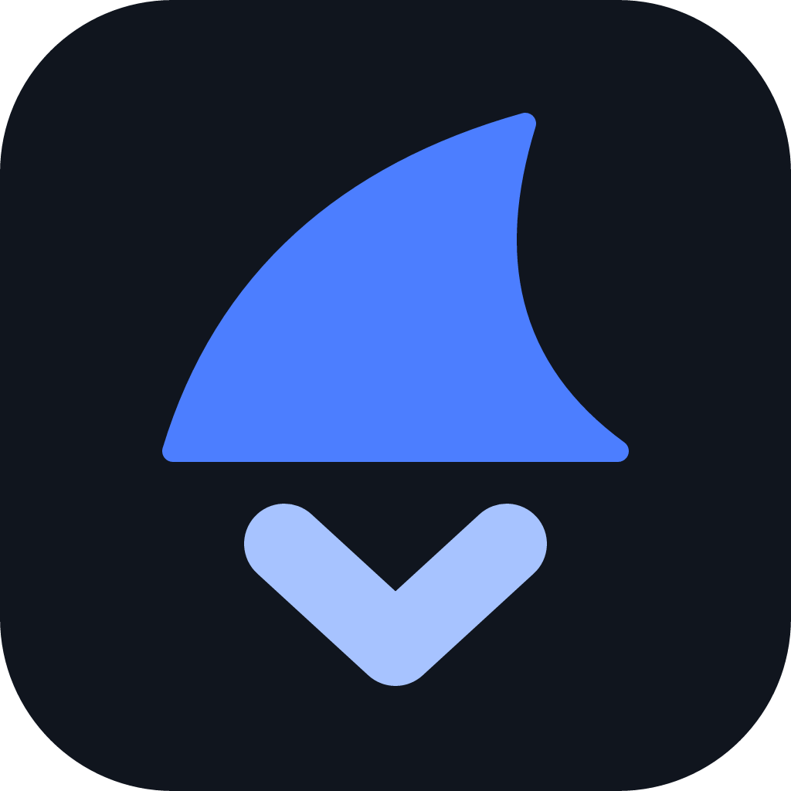
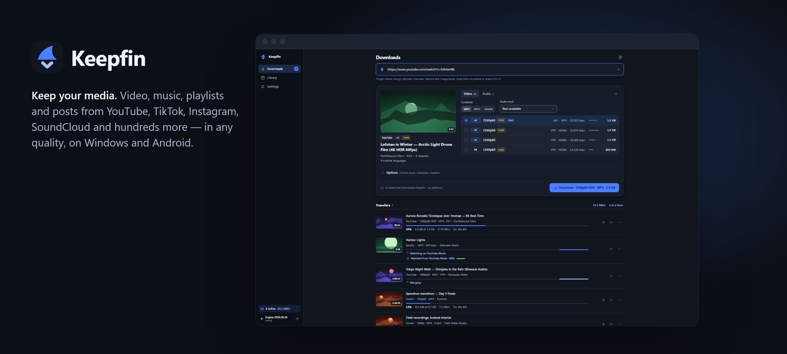
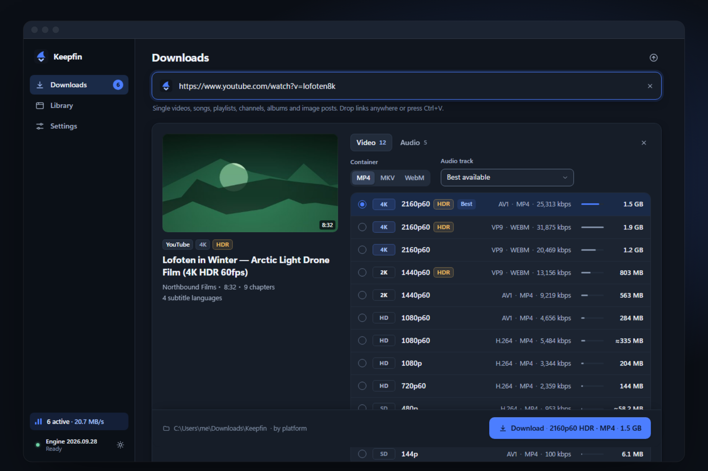
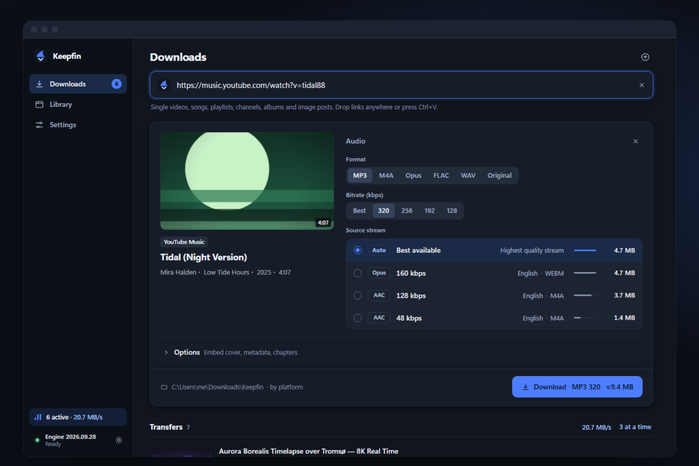
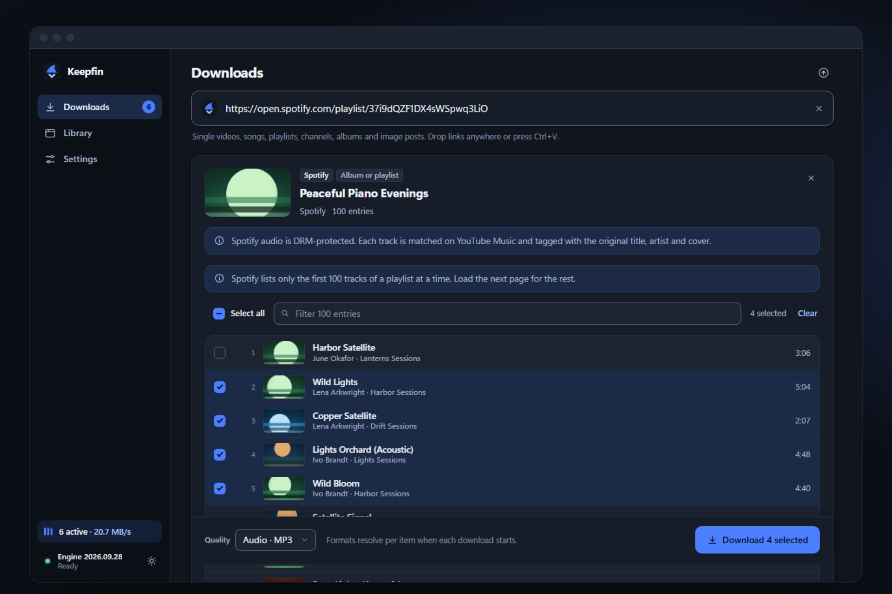
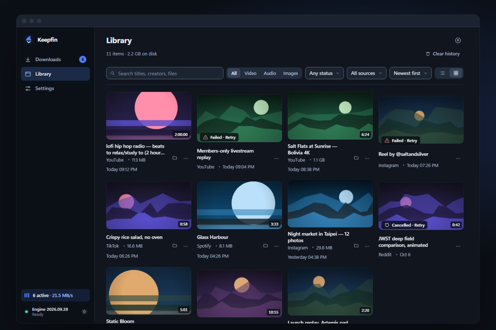
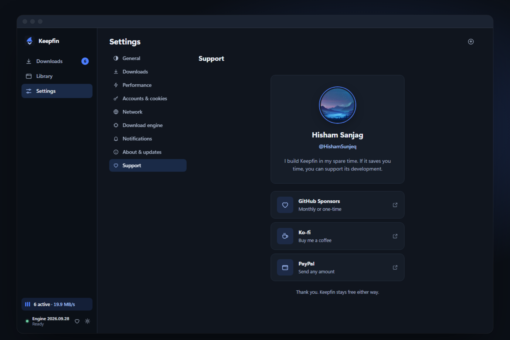

# Keepfin

**Keep your media.** Video, music, playlists and posts from YouTube, TikTok, Instagram, SoundCloud and hundreds more sites — in any quality, on Windows and Android.

<a href="https://github.com/HishamSunjeq/keepfin-releases/releases/latest"><b>⬇ Download the latest version</b></a>

  

<picture>
  <source media="(prefers-color-scheme: light)" srcset="assets/banner-light.png">
  
</picture>

## Download

Open **[the latest release](https://github.com/HishamSunjeq/keepfin-releases/releases/latest)** and pick your file:

| Platform | File | |
|---|---|---|
| **Windows** (recommended) | `Keepfin-Setup-<version>.exe` | Installs Keepfin and keeps it up to date from inside the app. |
| Windows (portable) | `Keepfin-Portable-<version>.exe` | Runs without installing. Replace the file to update. |
| **Android** | `Keepfin-Android-<version>.apk` | New versions install over it and keep your downloads. |

> **First launch on Windows:** Keepfin isn't code-signed yet, so SmartScreen may warn you. Choose **More info → Run anyway**.
>
> **On Android:** allow your browser or file manager to install apps when Android asks, then open the APK.

## Why Keepfin

<table>
<tr>
<td width="50%" valign="top">

### Every quality, with the size up front
4K, 8K, HDR, 60 fps — Keepfin lists every quality a site offers with the codec and the **estimated file size including audio**, so you know what you're getting before you download.

</td>
<td width="50%">
<picture>
  <source media="(prefers-color-scheme: light)" srcset="assets/formats-light.png">
  
</picture>
</td>
</tr>
<tr>
<td width="50%">
<picture>
  <source media="(prefers-color-scheme: light)" srcset="assets/audio-light.png">
  
</picture>
</td>
<td width="50%" valign="top">

### Music, properly tagged
Save audio as **MP3, M4A, Opus, FLAC or WAV** with cover art, artist and album tags. Paste a **Spotify, Apple Music or Deezer** link and Keepfin finds the same recording on YouTube Music and tags it with the original details.

</td>
</tr>
<tr>
<td width="50%" valign="top">

### Whole playlists, channels and albums
Entries appear as they load. Select what you want, load more, pick one quality for the batch and download them all — in parallel, with pause and resume.

</td>
<td width="50%">
<picture>
  <source media="(prefers-color-scheme: light)" srcset="assets/collections-light.png">
  
</picture>
</td>
</tr>
<tr>
<td width="50%">
<picture>
  <source media="(prefers-color-scheme: light)" srcset="assets/library-light.png">
  
</picture>
</td>
<td width="50%" valign="top">

### A library you'll actually use
Search, filter by type, sort by size or date, and open any file in a click. Removing an item from history never deletes your media.

</td>
</tr>
</table>

### And more

- 🔒 **Private and age-restricted content** — sign in once (Android) or use your browser's session (Windows).
- 📝 **Subtitles, chapters, SponsorBlock and trimming** — keep exactly the part you want.
- 🔄 **Always working** — the download engine updates itself as sites change, and the app updates itself too.
- 🛡️ **Local and private** — everything runs on your device. No account, no tracking, no ads.

**Works with** YouTube · YouTube Music · TikTok · Instagram · X · Facebook · Reddit · Vimeo · Twitch · SoundCloud · Bandcamp · Dailymotion · and many more.

## Support Keepfin

<table>
<tr>
<td width="55%" valign="top">

Keepfin is free and built in my spare time by **[Hisham Sanjag](https://github.com/HishamSunjeq)**. If it saves you time, you can support its development:

Thank you — Keepfin stays free either way.

</td>
<td width="45%">
<picture>
  <source media="(prefers-color-scheme: light)" srcset="assets/support-light.png">
  
</picture>
</td>
</tr>
</table>

---

This repository hosts Keepfin's published downloads. Each release lists what changed. Please only download content you have the right to save.
